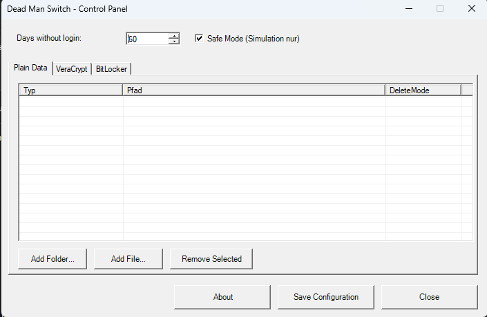

# 💀 Dead Man v1.1 💀

> **Für die wirklich Paranoiden unter uns** 🕵️  
> *Manchmal braucht man ein Fail-Safe, das niemandem außer dir selbst vertraut.*

Ein Windows-basiertes automatisches Datenvernichtungssystem, das nach einer bestimmten Anzahl von Tagen ohne Login ausgelöst wird.

**✨ NEU in v1.1:** Jetzt mit `DeadMan.exe` Launcher - einfach doppelklicken!



**[English Version](README.md)**

## 🚀 Zwei Wege zur Nutzung

**🎯 Für normale User** → `DeadMan.exe` nutzen (einfacher, interaktives Menü)  
**👨‍💻 Für Entwickler/Puristen** → PowerShell Scripts direkt (`DeadMan.ps1` oder `.bat` Dateien)

## ⚠️ WARNUNG

**BENUTZUNG AUF EIGENE GEFAHR!** Dieses Tool kann dauerhaft Daten löschen. Teste **IMMER** zuerst im Safe Mode und erstelle Backups wichtiger Daten!

## 🎯 Features

- **Automatischer Trigger**: Aktiviert sich nach X Tagen ohne Login
- **Safe Mode**: Teste das System ohne tatsächliche Löschung (Simulation)
- **Mehrere Lösch-Typen**:
  - Plain Dateien und Ordner
  - VeraCrypt Container und Keyfiles
  - BitLocker Recovery Keys
- **GUI Control Panel**: Einfach zu bedienende Konfigurationsoberfläche
- **Windows Tasks**: Automatische Überwachung bei Systemstart und Login
- **About-Dialog**: Mit tanzenden Bart! 🕺

## 📁 Projektstruktur

```
DeadMan/
├── config/               # Konfigurationsdateien (auto-erstellt)
│   ├── config.json
│   └── last_login.txt
├── logs/                 # Log-Dateien (auto-erstellt)
│   └── log.txt
├── scripts/              # PowerShell Scripts
│   ├── gui-config.ps1
│   ├── setup-tasks.ps1
│   ├── selfdestruct-check.ps1
│   └── update-last-login.ps1
├── bart.gif              # Unser tanzender Bart! 🎭
├── DeadMan.exe           # ⭐ NEU: Haupt-Launcher (Doppelklick!)
├── DeadMan.ps1           # PowerShell Launcher
├── .gitignore
└── README.md
```

## 🚀 Installation

### Voraussetzungen
- Windows 10/11
- PowerShell 5.1 oder höher
- Administrator-Rechte für die Installation

### Schritt-für-Schritt Anleitung

1. **Download und Entpacken**
   - Lade `DeadMan-v1.1.zip` von [Releases](https://github.com/iamrealguexoxo/DeadMan/releases) herunter
   - Entpacke in einen Ordner (z.B. `C:\DeadMan`)

   ODER klone das Repository:
   ```bash
   git clone https://github.com/iamrealguexoxo/DeadMan.git
   cd DeadMan
   ```

2. **Installation durchführen**
   
   **Option A: Mit EXE (Empfohlen)**
   - Doppelklick auf `DeadMan.exe`
   - Wähle **[2] Install** aus dem Menü
   - UAC Prompt bestätigen (Administrator erforderlich)
   
   **Option B: Mit PowerShell direkt**
   - Rechtsklick auf `install.bat` → "Als Administrator ausführen"
   - ODER: `powershell -ExecutionPolicy Bypass -File ".\scripts\setup-tasks.ps1"`
   
   Die Installation erstellt:
   - Zwei Windows Scheduled Tasks
   - Ordnerstruktur (config/, logs/)
   - Initiale last_login.txt

3. **Konfiguration**
   
   **Option A: Mit EXE**
   - Starte `DeadMan.exe` erneut
   - Wähle **[1] GUI** aus dem Menü
   
   **Option B: Mit Scripts**
   - Doppelklick auf `start.bat`
   - ODER: `powershell -ExecutionPolicy Bypass -File ".\DeadMan.ps1" -GUI`
   
   Das Control Panel öffnet sich

## 🎮 Verwendung

### Erstkonfiguration

1. **Control Panel starten**
   - **Mit EXE**: `DeadMan.exe` → Wähle [1] GUI
   - **Mit Scripts**: `start.bat` oder `DeadMan.ps1 -GUI`
2. **Tage einstellen**: Anzahl der Tage ohne Login (Standard: 30)
3. **Safe Mode**: ⚠️ **AKTIVIERT LASSEN** für Tests!
4. **Items hinzufügen**:
   - **Plain Data**: Normale Dateien und Ordner
   - **VeraCrypt**: Verschlüsselte Container und Keyfiles
   - **BitLocker**: Laufwerke (löscht Recovery Keys)
5. **Konfiguration speichern**: "Save Configuration" klicken

### Tabs im Control Panel

#### 📄 Plain Data
- **Add Folder...**: Ordner hinzufügen, der komplett gelöscht wird
- **Add File...**: Einzelne Dateien zum Löschen
- **Remove Selected**: Ausgewählten Eintrag entfernen

#### 🔐 VeraCrypt
- **Add Container...**: VeraCrypt Container (.hc, .vc)
- **Add Keyfile...**: Keyfile-Dateien
- Werden beim Trigger gelöscht

#### 💾 BitLocker
- **Laufwerk**: Buchstabe eingeben (z.B. D:)
- **Add Volume**: Laufwerk hinzufügen
- Löscht nur die Recovery Keys, nicht die Daten!

### Safe Mode testen

1. Konfiguriere das System mit **Safe Mode aktiviert**
2. Teste manuell (als Administrator):
   ```powershell
   cd C:\DeadMan
   .\scripts\selfdestruct-check.ps1 -ForceSafeMode
   ```
3. Prüfe die Logs:
   ```powershell
   Get-Content .\logs\log.txt -Tail 50
   ```
4. Im Safe Mode wird **nichts gelöscht**, nur simuliert!

### ⚠️ Safe Mode deaktivieren

**NUR NACH GRÜNDLICHEM TESTEN!**

1. Control Panel öffnen (`start.bat`)
2. Haken bei "Safe Mode (Simulation nur)" entfernen
3. "Save Configuration" klicken
4. ⚠️ **System ist jetzt SCHARF!**

## ⚙️ Wie funktioniert es?

### Scheduled Tasks

Nach der Installation laufen zwei Windows Tasks:

#### 1. DeadMan-UpdateLastLogin
- **Trigger**: Bei jedem User-Login
- **Aktion**: Aktualisiert `config\last_login.txt` mit aktuellem Datum
- **Rechte**: User-Level

#### 2. DeadMan-SelfDestructCheck
- **Trigger**: Bei jedem Windows-Start
- **Aktion**: Prüft ob Schwelle überschritten → führt ggf. Löschung aus
- **Rechte**: SYSTEM (höchste Rechte für Löschoperationen)

### Ablauf

```
1. Windows startet
   ↓
2. Task "SelfDestructCheck" läuft
   ↓
3. Liest last_login.txt
   ↓
4. Berechnet Differenz zu heute
   ↓
5. Wenn Tage >= Schwellenwert:
   ├─ Safe Mode: Simulation → Log
   └─ Live Mode: ECHTE LÖSCHUNG!
```

## 📝 Konfigurationsdatei

`config/config.json`:
```json
{
  "DaysWithoutLogin": 30,
  "SafeMode": true,
  "Executed": false,
  "ExecutedAt": null,
  "Items": [
    {
      "Type": "PlainFolder",
      "DeleteMode": "DeleteFolder",
      "Path": "C:\\SensitiveData"
    },
    {
      "Type": "VeraCryptContainer",
      "DeleteMode": "DeleteFile",
      "Path": "D:\\secret.hc"
    },
    {
      "Type": "BitLockerVolume",
      "DeleteMode": "DeleteRecoveryKeys",
      "Path": "",
      "Drive": "E:"
    }
  ]
}
```

## 🗑️ Lösch-Modi

| Typ | Beschreibung | Aktion |
|-----|--------------|--------|
| `PlainFolder` | Normaler Ordner | Löscht Ordner + Inhalt rekursiv |
| `PlainFile` | Normale Datei | Löscht Datei |
| `VeraCryptContainer` | Verschlüsselter Container | Löscht Container-Datei |
| `VeraCryptKeyfile` | VeraCrypt Keyfile | Löscht Keyfile |
| `BitLockerVolume` | BitLocker Laufwerk | Löscht alle Recovery Keys |

## 🔧 Manuelle Operationen

### Tasks anzeigen
```powershell
# PowerShell
Get-ScheduledTask | Where-Object { $_.TaskName -like "DeadMan*" }

# Oder Aufgabenplanung öffnen
taskschd.msc
```
Tasks sind in der **Root-Ebene** der Aufgabenplanungsbibliothek!

### Manueller Test (Safe Mode)
```powershell
# Als Administrator
cd C:\DeadMan
.\scripts\selfdestruct-check.ps1 -ForceSafeMode
```

### Letzten Login prüfen
```powershell
Get-Content C:\DeadMan\config\last_login.txt
```

### Logs ansehen
```powershell
Get-Content C:\DeadMan\logs\log.txt -Tail 50
```

### Config bearbeiten
```powershell
notepad C:\DeadMan\config\config.json
```

## 🛡️ Sicherheitshinweise

- **Speicherort**: Tool an einem Ort aufbewahren, auf den nur DU Zugriff hast
- **Verschlüsselung**: Nutze Full-Disk-Encryption (BitLocker/VeraCrypt)
- **Config-Datei**: Enthält Pfade zu sensiblen Daten - schützen!
- **Admin-Zugriff**: Überlege, was passiert wenn jemand Admin-Rechte erlangt
- **Testen!**: Immer im Safe Mode testen bevor du scharf schaltest!
- **Backups**: Erstelle Backups wichtiger Daten an sicheren Orten

## ⚡ Deinstallation

### Via PowerShell (als Administrator)
```powershell
# Tasks löschen
Unregister-ScheduledTask -TaskName "DeadMan-UpdateLastLogin" -Confirm:$false
Unregister-ScheduledTask -TaskName "DeadMan-SelfDestructCheck" -Confirm:$false

# Ordner löschen
Remove-Item -Path "C:\DeadMan" -Recurse -Force
```

### Manuell
1. Öffne Aufgabenplanung (`taskschd.msc`)
2. Lösche beide Tasks:
   - `DeadMan-UpdateLastLogin`
   - `DeadMan-SelfDestructCheck`
3. Lösche den `C:\DeadMan` Ordner

## 🐛 Troubleshooting

### Task läuft nicht
- Prüfe Aufgabenplanung auf Fehler
- Stelle sicher, dass Skript-Pfade korrekt sind
- Führe PowerShell als Administrator aus

### GUI startet nicht
- Prüfe PowerShell Execution Policy:
  ```powershell
  Set-ExecutionPolicy -ExecutionPolicy RemoteSigned -Scope CurrentUser
  ```
- Rechtsklick auf `start.bat` → "Als Administrator ausführen"

### Logs sind leer
- Stelle sicher, dass `logs/` Ordner existiert
- Prüfe Schreibrechte
- Führe Scripts als Administrator aus

### About-Dialog zeigt kein GIF
- Stelle sicher, dass `bart.gif` im Root-Verzeichnis liegt
- Prüfe, ob die Datei beschädigt ist
- Fallback: ASCII-Art Bart wird angezeigt

## 📜 Lizenz

MIT License - Benutzung auf eigene Gefahr!

## 🙏 Credits

- **Creator**: [iamrealguexoxo](https://github.com/iamrealguexoxo) 🎭
- **Inspiration**: BartsTOK und andere Projekte
- **Tanzender Bart**: Die Simpsons © Fox

## 🤝 Mitwirken

Contributions sind willkommen! Bitte:
1. Teste gründlich
2. Behalte Safe Mode als Standard
3. Dokumentiere alle Änderungen
4. Bedenke Sicherheitsaspekte

## ⚠️ Haftungsausschluss

Dieses Tool wird ohne jegliche Garantie bereitgestellt. Die Autoren sind nicht verantwortlich für Datenverlust oder Schäden. Teste immer im Safe Mode und erstelle Backups wichtiger Daten. Nutze es verantwortungsvoll und legal.

---

**Viel Spaß mit dem Dead Man Switch!** 💀🕺

*Denk dran: Mit großer Macht kommt große Verantwortung. Oder so ähnlich...* 😎
